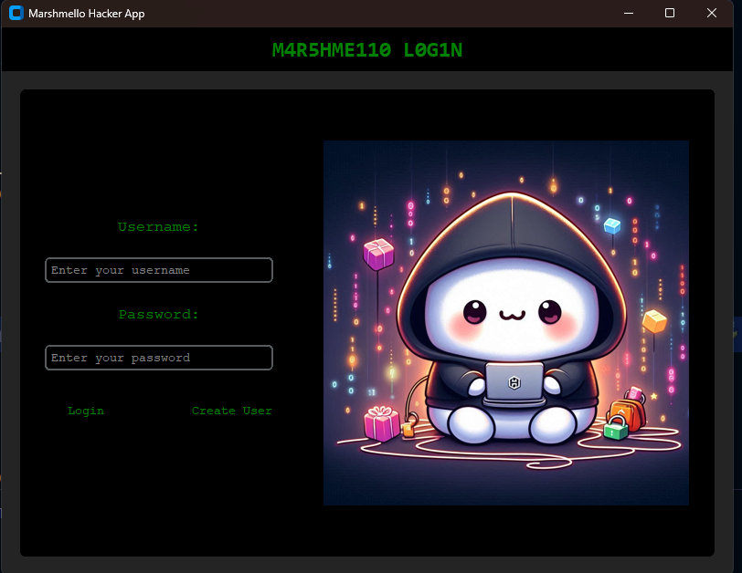

# Marshmello Space
"Marshmello Space" is a chat platform that uses TOR like networking to send/receive messages.

What the TOR implementation does is:
- Pass the requests through a circuit of relays
- Ensure encrypted communication using RSA and AES

The result is a method of sending messages which has multiple layers of encryption, and the networking nature insures that the different layers only know who send and to who redirect(eg. with 3 layers the server doesnt know the origin IP of the sender)

## How to run
For testing the project I recommend running everything locally using the Docker scritps provided.

## What the project consists of

The project is heavily based on HTTP in Golang and Python. 

The project also features a usage of containers in Docker.

### The Server
The server is composed of 3 services:
- Auth and User service: Manages authentication(JWT) and users in the system. The service can access a PostgreSQL container that stores the users.
- Messaging service: Manages the messages. The service has access to a mongoDB service that stores messages. 
- API gateway: Receives requests and redirects them to the right service

Every server service is written in FastAPI(HTTP) in python and the whole backend is deployed in a containerize environment divided to networks to ensure seperation.

### The Relays
The relays are written in Golang and also expose HTTP api. The relays have 3 API methods:
- Exchange keys: Using RSA, two entities make an exchange of AES keys
- Set Redirection: The relay receives an IP and sets it as its redirection target.
- Redirect: Get a request and redirect it to the previously set IP

To save the context between API calls the relays store a session key and the relevant data(encryoption keys and the redirection IP) inside a REDIS service they set up(in containers obviously).

The main operation of the relays is to receive an encrypted message->decrpyt it->perform the action encapsulated->encrypt the response.

This operation of the relays is what creates the TOR like networking

### The Client
The client is written partially with Golang and Python, where Python is used as the GUI code(using Costume Tkinter) and go is used for the communication with the relays.

The communication between the processes is performed via http(to keep simplicity) where the go code sets up a simple HTTP port and the python client sends the data from the user to it.

